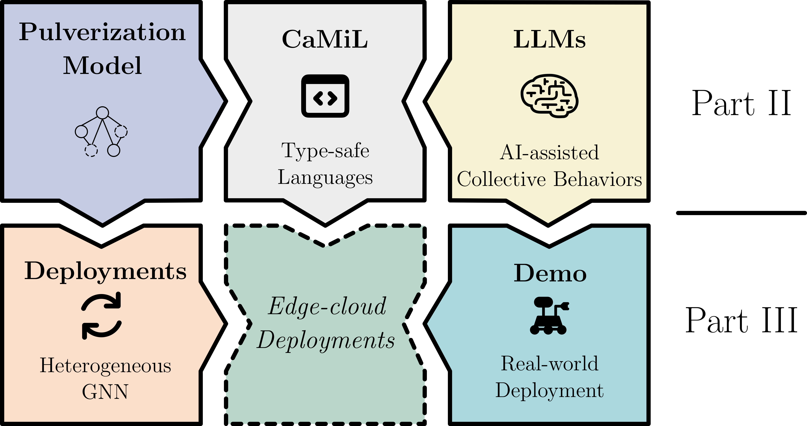

# Engineering Collective Systems in the Wearable Edge-Cloud Continuum: Models and Platform

## Publications

The thesis is organized around two main contributions, and the publications below follow the same narrative flow.

### Model

This first contribution covers the pulverization model, language support with LLMs, and the demonstrator that ties the model to a concrete use case.

- **Scalability through Pulverisation: Declarative deployment reconfiguration at runtime**
  - _Authors_: Nicolas Farabegoli, Danilo Pianini, Roberto Casadei, Mirko Viroli
  - _DOI_: [10.1016/j.future.2024.07.042](https://doi.org/10.1016/j.future.2024.07.042)
  - _Year_: 2024

- **A Language-based Approach to Macroprogramming for IoT Systems through Large Language Models**
  - _Authors_: Gianluca Aguzzi, Nicolas Farabegoli, Mirko Viroli
  - _DOI_: [10.1145/3758326](https://doi.org/10.1145/3758326)
  - _Year_: 2025

- **Capabilities to Catch 'em All: Unify Choreography, Multitier and Aggregate Computing**
  - _Authors_: Nicolas Farabegoli, Pascal Weisemburger, Mirko Viroli, Guido Salvaneschi
  - _DOI_: Currently under review at [ACM Transactions on Programming Languages and Systems](https://dl.acm.org/journal/toplas).
  - _Year_: 2026

- **ScalaTropy: Multiparty Coordination with Monadic Communication Primitives**
  - _Authors_: Nicolas Farabegoli, Luca Tassinari, Gianluca Aguzzi, Mirko Viroli
  - _DOI_: Accepted at [COORDINATION 2026](http://www.discotec.org/2026/coordination.html).
  - _Year_: 2026

- **A Demonstrator for Self-organizing Robot Teams**
  - _Authors_: Gianluca Aguzzi, Lorenzo Bacchini, Martina Baiardi, Roberto Casadei, Angela Cortecchia, Davide Domini, Nicolas Farabegoli, Danilo Pianini, Mirko Viroli
  - _DOI_: [10.1007/978-3-031-95589-1_12](https://doi.org/10.1007/978-3-031-95589-1_12)
  - _Year_: 2025

### Deployments and Reconfiguration

This second contribution focuses on deployment-level concerns, runtime reconfiguration, and intelligent offloading in the edge-cloud continuum.

- **Flexible Self-organisation for the Cloud-Edge Continuum: a Macro-programming Approach**
  - _Authors_: Nicolas Farabegoli, Mirko Viroli, Roberto Casadei
  - _DOI_: [10.1109/acsos61780.2024.00020](https://doi.org/10.1109/acsos61780.2024.00020)
  - _Year_: 2024

- **Dynamic IoT deployment reconfiguration: A global-level self-organisation approach**
  - _Authors_: Nicolas Farabegoli, Danilo Pianini, Roberto Casadei, Mirko Viroli
  - _DOI_: [10.1016/j.iot.2024.101412](https://doi.org/10.1016/j.iot.2024.101412)
  - _Year_: 2024

- **Heterogeneous GNN for collective-task offloading in cloud-edge via deep Q-learning**
  - _Authors_: Nicolas Farabegoli, Davide Domini, Gianluca Aguzzi, Mirko Viroli
  - _DOI_: [10.1016/j.future.2026.108539](https://doi.org/10.1016/j.future.2026.108539)
  - _Year_: 2026

- **Declarative Deployment Planning for Green Pulverised Collective Computational Systems**
  - _Authors_: Antonio Brogi, Roberto Casadei, Nicolas Farabegoli, Stefano Forti, Mirko Viroli
  - _DOI_: [10.1007/978-3-031-95589-1_6](https://doi.org/10.1007/978-3-031-95589-1_6)
  - _Year_: 2025

## Thesis Structure
The thesis can be read as a three-part flow: background foundations, the model contribution, and the deployment/reconfiguration contribution.
  - Part I: Background
  - Part II: Model
  - Part III: Deployments and Reconfiguration
  

  

## Part I -- Background

This part gathers all the state of the art and background material relevant to the thesis.

### Chapter 2 -- Programming Models for Large-scale Distributed Systems
  - Introduction to Macroprogramming
    - The shift from node-centric to global-centric programming.
    - Relevance for engineering large-scale distributed systems.
  - Foundational Macroprogramming Paradigms
    - Aggregate Computing: Core concepts, Field/XC Calculus.
    - Choreographic Programming: Global viewpoints, interaction descriptions, and endpoint projection.
    - Multitier Programming: placed computation, architecture conformance, cross-tier communication.
  - Advanced Linguistic Abstractions for Coordination
    - Monads, Effects, and Capabilities.
  - Large Language Models in Software Engineering
    - Brief overview of LLMs applied to code generation and DSLs.

### Chapter 3 -- Architectures and Platforms in the Edge-Cloud Continuum
  - The Edge-Cloud Continuum
    - Definition, topology, characteristics, and challenges (heterogeneity, network partitions).
  - Target Environments: Cyber-Physical Systems & Swarms
    - IoT ecosystems and Swarm Robotics.
  - Architectural Paradigms for Pervasive Systems
    - From Microservices to finer-grained models.
    - The Pulverisation Approach: Conceptual background on breaking down software into logical, deployable units.
  - Collective Adaptive Systems (CAS)
    - Principles of self-organisation and collective intelligence in platforms.

### Chapter 4 -- Dynamic Reconfiguration and Intelligent Offloading
  - The Deployment Problem
    - Static vs. dynamic deployment and the challenges of runtime reconfiguration.
  - Declarative and Green Deployment Planning
    - Optimization strategies and declarative constraints for mapping logical components to physical edge/cloud nodes.
  - Machine Learning for Distributed Network Topologies
    - Reinforcement Learning & Deep Q-Learning: Basics of agent-based learning in changing environments.
    - Graph Neural Networks (GNNs): How GNNs can represent and analyze edge-cloud topologies.

## Part II -- Model

This part follows the model-related publications, moving from pulverization to language and coordination support.

### Chapter 5 -- The Pulverization Model
  - Motivation and design goals
    - Why coarse-grained distributed systems need a finer deployment model.
  - Core abstractions
    - Logical vs. physical decomposition.
    - Deployable units, placement, and runtime remapping.
  - Semantics and guarantees
    - What properties the model preserves during partitioning and execution.

### Chapter 6 -- Language and Coordination Support for Collective Systems
  - A Language-based Approach to Macroprogramming for IoT Systems through Large Language Models
    - How LLMs support macroprogramming for collective IoT systems.
  - Capabilities to Catch 'em All: Unify Choreography, Multitier and Aggregate Computing
    - How the language unifies the main coordination paradigms used in the thesis.
  - ScalaTropy: Multiparty Coordination with Monadic Communication Primitives
    - How monadic communication primitives support multiparty coordination.

## Part III -- Deployments and Reconfiguration

This part explores practical deployment strategies, evolving from foundational reconfiguration policies and declarative planning toward a deep reinforcement learning approach for offloading, and concludes with an end-to-end demonstrator.

### Chapter 7 -- Evolution of Deployment and Reconfiguration Strategies
  - Macro-programming for the continuum and self-organisation as deployment control
  - Dynamic IoT deployment reconfiguration and global-level adaptation
  - Declarative deployment planning for green pulverised collective systems

### Chapter 8 -- Heterogeneous GNN for collective-task offloading in cloud-edge via deep Q-learning
  - Offloading as a learning problem
    - Why task placement in the cloud-edge continuum needs data-driven decision support.
  - Heterogeneous topology representation
    - How the network structure and device diversity are encoded for the learner.
  - Deep Q-learning for collective tasks
    - How the model selects offloading actions under changing conditions.
  - Experimental validation
    - How the approach is assessed on realistic collective-task scenarios.

### Chapter 9 -- A Demonstrator for Self-organizing Robot Teams
  - Demonstrator architecture
    - How the demonstrator connects the pulverization model, language results, and deployment strategies to a real system.
  - Self-organizing robot team workflow
    - End-to-end flow from specification to execution in the swarm setting.
  - Evaluation and lessons learned
    - Evidence that the approach works in practice.
